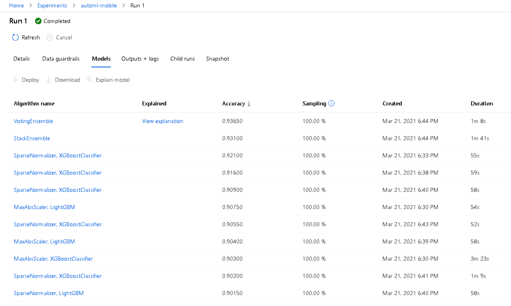

# Udacity Machine Learning Engineer on Azure Capstone: Mobile Phone Prices Classification


In this project, we use the knowledge obtained from the mentioned Nanodegree to 
solve an interesting problem: **Mobile Prices Classification Based on Technical Charateristics**. 

In this project, two models will be created: one using Automated ML (denoted as AutoML from now on) and one customized model whose hyperparameters are tuned using HyperDrive. We will then compare the performance of both the models and deploy the best performing model.

This project aims to demonstrate the ability to use an external dataset in our workspace, train a model using the different tools available in the AzureML framework as well as our ability to deploy the model as a web service.

<figure style='text-align:center'>
    
    <figcaption style='text-align:center'>Figure 1: Project Workflow</figcaption>
</figure>

## Project Set Up and Installation
*OPTIONAL:* If your project has any special installation steps, this is where you should put it. To turn this project into a professional portfolio project, you are encouraged to explain how to set up this project in AzureML.

## Dataset

### Overview
*TODO*: Explain about the data you are using and where you got it from.

For this project, the data used is **Mobile Price Classification** ([data source](https://www.kaggle.com/iabhishekofficial/mobile-price-classification?select=train.csv))
from Kaggle website. The description provided in Kaggle is the following one:

```
Bob has started his own mobile company. He wants to give tough fight to big companies like Apple,Samsung etc.

He does not know how to estimate price of mobiles his company creates. In this competitive mobile phone market you cannot simply assume things. To solve this problem he collects sales data of mobile phones of various companies.

Bob wants to find out some relation between features of a mobile phone(eg:- RAM,Internal Memory etc) and its selling price. But he is not so good at Machine Learning. So he needs your help to solve this problem.

In this problem you do not have to predict actual price but a price range indicating how high the price is.
```

We are using the *train.csv* file.

### Task
*TODO*: Explain the task you are going to be solving with this dataset and the features you will be using for it.

As described above, we are using some technical characteristics of mobile phones
to classify their prices between 0 and 3. So that, we have a Multi-Label
Classification Problem.

The features available are the following:

* **battery_power**: Total energy a battery can store in one time measured in mAh.

* **blue**: Has bluetooth or not.

* **clock_speed**: speed at which microprocessor executes instructions.

* **dual_sim**: Has dual sim support or not.

* **fc**: Front Camera mega pixels

* **four_g**: Has 4G or not.

* **int_memory**: Internal Memory in Gigabytes.

* **m_dep**: Mobile Depth in cm.

* **mobile_wt**: Weight of mobile phone.

* **n_cores**: Number of cores of processor.

* **pc**: Primary Camera mega pixels.

* **px_height**: Pixel Resolution Height.

* **px_width**: Pixel Resolution Width.

* **ram**: Random Access Memory in Mega Bytes.

* **sc_h**: Screen Height of mobile in cm.

* **sc_w**: Screen Width of mobile in cm.

* **talk_time**: longest time that a single battery charge will last when you are.

* **three_g**: Has 3G or not.

* **touch_screen**: Has touch screen or not.

* **wifi**: Has wifi or not.

* **price_range**: This is the target variable with value of 0 (low cost), 1 (medium cost), 2 (high cost) and 3 (very high cost).

<figure style='text-align:center'>
    
    <figcaption style='text-align:center'>Figure 2: Target Feature</figcaption>
</figure>

In Figure 2 we can observe the Data Profile of our dataset. In this case we have a balanced target for training set, i.e., each class has almost the same representation. This is important because it makes it easier to create a general model using classical
metrics such as Accuracy or ROC-AUC.

### Access
To access data in our Workspace, we upload it from *train.csv* local file. We 
set the upload parameters (Tabular Data, separated by commas, with header, etc.).

This way, if we go to *Datasets* tab in ML Studio, we can see our Dataset and
watch a Profile as the one shown in Figure 2 and even get a Python SDK chunk to 
consume this dataset.

<figure style='text-align:center'>
    
    <figcaption style='text-align:center'>Figure 3: Datasets Section After Uploading Data</figcaption>
</figure>

<figure style='text-align:center'>
    
    <figcaption style='text-align:center'>Figure 4: Details and Available Options for Uploaded Dataset.</figcaption>
</figure>

## Automated ML
Once we have some sensitivity about data, we are going to train a classifier 
using an ML model. Modeling is an art but we have some interesting tools that 
help us to obtain an acceptable ML model without doing much feature engineering.
This is the case of AutoML models. These tools work by comparing different 
candidate algorithms and hyperparameters so that computational cost is high.

Azure AutoML module is optimised to do this tasks in a more efficient way than
if a normal person develops by himself. To this fact, we add the possibility of
using powerful servers on demand to run this tasks so the more yo need (and pay)
the more you have. These servers where AutoML runs are called Computer Instances
(or compute targets).

The first model obtained is the one using AutoML. To do it, we use the automl.ipynb
file. In this notebook, we use the Python SDK to load the registered dataset and
configure an AutoML run. After that, the best model obtained is saved and if the 
results in terms of Accuracy are better than those obtained using Hyperparameter
Tuning, then the model is deployed and consumed as an API.

As part of the AutoML Configuration, it is used a Compute Target STANDARD_D2_V2 
with 4 `max_nodes`. This Compute Target is called `automl-mobiles`.

<figure style='text-align:center'>
    
    <figcaption style='text-align:center'>Figure 6: Azure Compute Cluster for AutoML Run.</figcaption>
</figure>

Configuration:

```
automl_settings = {
    "experiment_timeout_minutes": 20,
    "max_concurrent_iterations": 4,
    "primary_metric" : 'accuracy'
}
project_folder = './automl-mobile-udacity'
automl_config = AutoMLConfig(compute_target=cpu_cluster,
                             task = "classification",
                             training_data=dataset,
                             label_column_name="price_range",   
                             path = project_folder,
                             n_cross_validations=5,
                             enable_early_stopping= True,
                             featurization= 'auto',
                             debug_log = "automl_errors.log",
                             **automl_settings
                            )
```

* **experiment_timeout_minutes**: Maximum amount of time in minutes that all iterations combined can take before the experiment terminates. In this case is set to 20 so that we can have time enough to do all the steps in the project.
* **max_concurrent_iterations**: Represents the maximum number of iterations that would be executed in parallel. The default value is 1. This value is bounded
by the number of maximum nodes chosen for Compute Target. In our case, this value is 4 so that we set the same number of max_concurrent_iterations.
* **primary_metric**: The metric that Automated Machine Learning will optimize for model selection. Automated Machine Learning collects more metrics than it can optimize. In this case, as we have a balanced target for Multi Label Classification, 'accuracy' seems to be a good option.
* **compute_target**: The Azure Machine Learning compute target to run the Automated Machine Learning experiment on (see Figure 6).
* **task**:The type of task to run. Values can be 'classification', 'regression', or 'forecasting' depending on the type of automated ML problem to solve. In this case, it's obviously 'classification'.
* **training_data**: The training data to be used within the experiment. It should contain both training features and a label column (optionally a sample weights column). If training_data is specified, then the label_column_name parameter must also be specified.
* **label_column_name**: The name of the label column. If the input data is from a pandas.DataFrame which doesn't have column names, column indices can be used instead, expressed as integers. In this case, the column in *training_data* that we want to predict is 'price_range'.
* **path**: The full path to the Azure Machine Learning project folder. If not specified, the default is to use the current directory or ".". Our project folder is called './automl-mobile-udacity'.
* **n_cross_validations**:How many cross validations to perform when user validation data is not specified. In this case, with 2000 rows it seems natural that we take a 20% for validation.
* **enable_early_stopping**: Whether to enable early termination if the score is not improving in the short term. The default is False.

    * Default behavior for stopping criteria:

        1. If iteration and experiment timeout are not specified, then early stopping is turned on and experiment_timeout = 6 days, num_iterations = 1000.

        2. If experiment timeout is specified, then early_stopping = off, num_iterations = 1000.

    * Early stopping logic:

        1. No early stopping for first 20 iterations (landmarks).

        2. Early stopping window starts on the 21st iteration and looks for early_stopping_n_iters iterations (currently set to 10). This means that the first iteration where stopping can occur is the 31st.

        3. AutoML still schedules 2 ensemble iterations AFTER early stopping, which might result in higher scores.

        4. Early stopping is triggered if the absolute value of best score calculated is the same for past early_stopping_n_iters iterations, that is, if there is no improvement in score for early_stopping_n_iters iterations.

* **featurization**: auto' / 'off' / FeaturizationConfig Indicator for whether featurization step should be done automatically or not, or whether customized featurization should be used. Note: If the input data is sparse, featurization cannot be turned on.

    Column type is automatically detected. Based on the detected column type preprocessing/featurization is done as follows:

    * Categorical: Target encoding, one hot encoding, drop high cardinality categories, impute missing values.

    * Numeric: Impute missing values, cluster distance, weight of evidence.

    * DateTime: Several features such as day, seconds, minutes, hours etc.

    * Text: Bag of words, pre-trained Word embedding, text target encoding.

    More details can be found in the article [Configure automated ML experiments in Python](https://docs.microsoft.com/en-us/azure/machine-learning/how-to-configure-auto-train#data-featurization).

    This time, no specific featurization is proposed so that we keep it as 'auto'.

### Results
*TODO*: What are the results you got with your automated ML model? What were the parameters of the model? How could you have improved it?

As a summary, we have a *Classification* task with a training dataset with 2000
rows. As this number is low, we decide to implement cross validation with 5 folds.
Although, for the moment, we do normal CV, a good way of improving the model would be 
to do an Stratified 5-Fold split, so that we can make sure that every class is 
homogeneously represented in each folder.

We decide to submit the experiment to our compute target and let's see what is 
obtained.

<figure>
    
    <figcaption style="text-align:center">Figure 7: Successful AutoML experiment run on 
    cpu_cluster.</figcaption>
</figure>

In Figure 7 we can observe a list of models, sorted by Accuracy (our primary metric).
In the first position, the best model is shown: it is a `Voting Ensemble` model
which provides predictions with a 94.7% accuracy on cross validation. This is the
model that we are going to compare with the one obtained using HyperDrive in order 
to choose which one deploy. In Figure 8, Details about the mentioned model are 
displayed.

<figure>
    
    <figcaption style="text-align:center">Figure 8: Details about Best Model including the Run Id.</figcaption>
</figure>

To go deeper in Best Model analysis, we decide to check out the Metrics Tab and 
calculate Explanations. This second step is going to be useful in order to know
which features are the most important for the model and which have the strongest 
relationship with Target feature.

<figure>
    
    <figcaption style="text-align:center">Figure 9: Best Model Metrics.</figcaption>
</figure>

<figure>
    
    <figcaption style="text-align:center">Figure 10: Confusion Matrix for the Best Model.</figcaption>
</figure>

What can be concluded from Figure 9 and 10 is that this model works with impressing
results. The 94% of accuracy can be checked as real because this happens for all
of the classes. This is a quite well informed dataset and, as it's well known, 
good data can easily lead to good models.

<figure>
    
    <figcaption style="text-align:center">Figure 11: Bar plot of feature importances for AutoML model.</figcaption>
</figure>

<figure>
    
    <figcaption style="text-align:center">Figure 12: Box Plot of feature importances for AutoML model.</figcaption>
</figure>

As we can see in Figures 11 and 12, the most important feature for the classification
task is the RAM. This really makes a lot of sense, because this is one of the main
properties in a mobile phone in terms of speed and fluid navigation as it happens 
with computers. Generally, the more RAM a device has, the more expensive it is. It is not
the only important feature but high internal correlations between RAM and other
properties let us know that, only with this feature, we could obtain a good model. 

*TODO* Remeber to provide screenshots of the `RunDetails` widget as well as a screenshot of the best model trained with it's parameters.

HOW COULD BE THIS MODEL IMPROVED?

Eventhugh accuracy is good, there are different things that can be done to 
improve the model in future developments. 

First of all, the easiest way could be increasing the experiment timeout and the
number of nodes for parallelization. With this, we increase the search space and
it is more likely to find a good model. However, it's not completely guaranteed
that a bettern model is going to be found and if the improvement is worthwile in a costs-benefit balance.

Other possible source of improvement is to do some kind of Feature Engineering to
the data. We can research more about our mobile price clasification problem and
do some feature engineering with the available data. For example, we know that a
mobile phone can be weighted due to the size or due to old components so, we could 
calculate its volumetric or superficial density using weight, width, height and 
depth. Other option would be calculating the ratio screen/total so that, if this
ratio is low it can mean that it is an old mobile phone and has a lower price. 
After this first run, we have some information obtained from feature importances
and we can use it as part of the feature engineering mentioned.

Finally, to ensure as much as possible our model is robust, we could add Stratified K-Fold split and specify it in cross validation parameters.


## Hyperparameter Tuning
*TODO*: What kind of model did you choose for this experiment and why? Give an overview of the types of parameters and their ranges used for the hyperparameter search


### Results
*TODO*: What are the results you got with your model? What were the parameters of the model? How could you have improved it?

*TODO* Remeber to provide screenshots of the `RunDetails` widget as well as a screenshot of the best model trained with it's parameters.

## Model Deployment
*TODO*: Give an overview of the deployed model and instructions on how to query the endpoint with a sample input.

## Screen Recording
*TODO* Provide a link to a screen recording of the project in action. Remember that the screencast should demonstrate:
- A working model
- Demo of the deployed  model
- Demo of a sample request sent to the endpoint and its response

## Standout Suggestions
*TODO (Optional):* This is where you can provide information about any standout suggestions that you have attempted.
