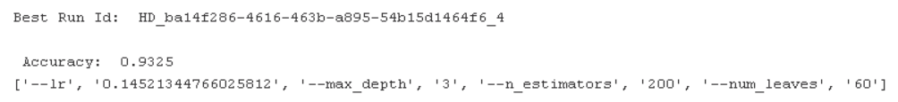
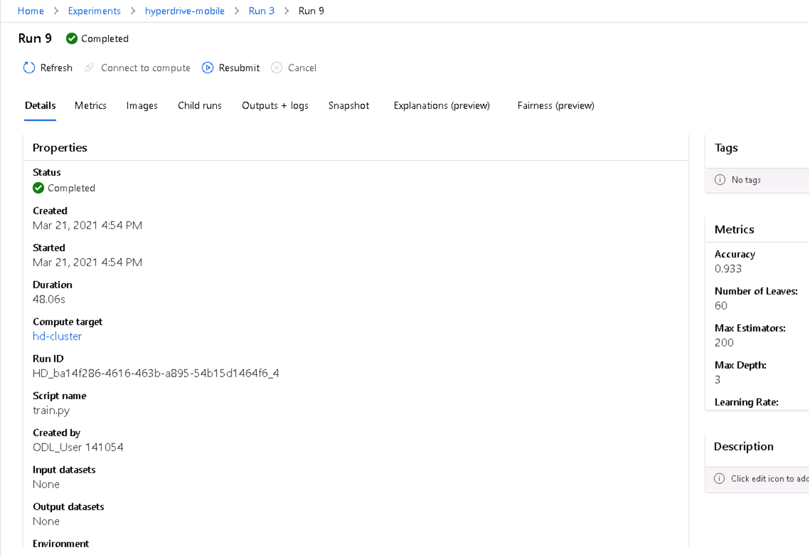
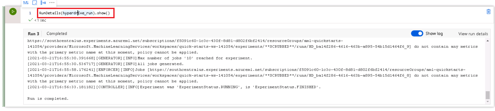
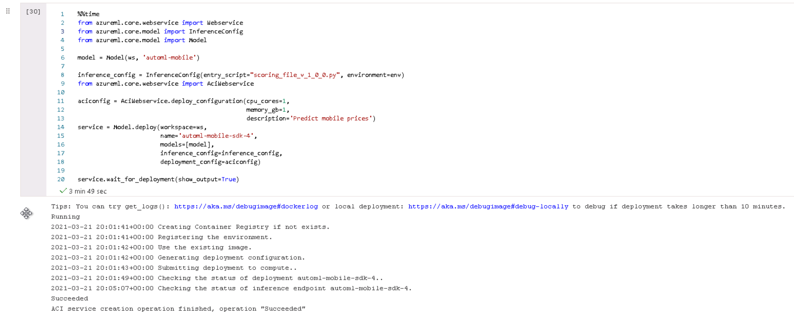
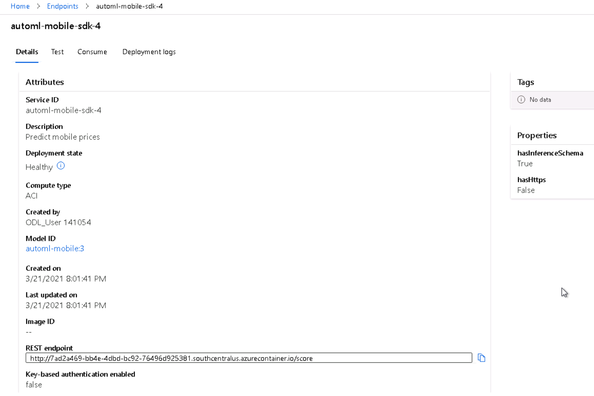
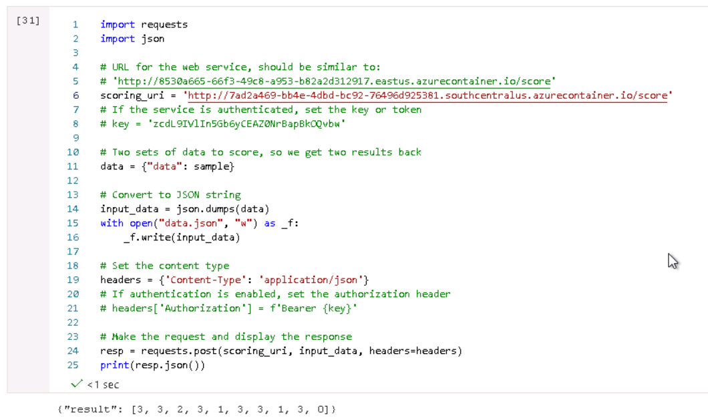

# Udacity Machine Learning Engineer on Azure Capstone: Mobile Phone Prices Classification


In this project, we use the knowledge obtained from the mentioned Nanodegree to 
solve an interesting problem: **Mobile Prices Classification Based on Technical Charateristics**. 

In this project, two models will be created: one using Automated ML (denoted as AutoML from now on) and one customized model whose hyperparameters are tuned using HyperDrive. We will then compare the performance of both the models and deploy the best performing model.

This project aims to demonstrate the ability to use an external dataset in our workspace, train a model using the different tools available in the AzureML framework as well as our ability to deploy the model as a web service.

<figure style='text-align:center'>
    
    <figcaption style='text-align:center'>Figure 1: Project Workflow</figcaption>
</figure>

## Dataset

### Overview

For this project, the data used is **Mobile Price Classification** ([data source](https://www.kaggle.com/iabhishekofficial/mobile-price-classification?select=train.csv))
from Kaggle website. The description provided in Kaggle is the following one:

```
Bob has started his own mobile company. He wants to give tough fight to big companies like Apple,Samsung etc.

He does not know how to estimate price of mobiles his company creates. In this competitive mobile phone market you cannot simply assume things. To solve this problem he collects sales data of mobile phones of various companies.

Bob wants to find out some relation between features of a mobile phone(eg:- RAM,Internal Memory etc) and its selling price. But he is not so good at Machine Learning. So he needs your help to solve this problem.

In this problem you do not have to predict actual price but a price range indicating how high the price is.
```

We are using the *train.csv* file.

### Task

As described above, we are using some technical characteristics of mobile phones
to classify their prices between 0 and 3. So that, we have a Multi-Label
Classification Problem.

The features available are the following:

* **battery_power**: Total energy a battery can store in one time measured in mAh.

* **blue**: Has bluetooth or not.

* **clock_speed**: speed at which microprocessor executes instructions.

* **dual_sim**: Has dual sim support or not.

* **fc**: Front Camera mega pixels

* **four_g**: Has 4G or not.

* **int_memory**: Internal Memory in Gigabytes.

* **m_dep**: Mobile Depth in cm.

* **mobile_wt**: Weight of mobile phone.

* **n_cores**: Number of cores of processor.

* **pc**: Primary Camera mega pixels.

* **px_height**: Pixel Resolution Height.

* **px_width**: Pixel Resolution Width.

* **ram**: Random Access Memory in Mega Bytes.

* **sc_h**: Screen Height of mobile in cm.

* **sc_w**: Screen Width of mobile in cm.

* **talk_time**: longest time that a single battery charge will last when you are talking.

* **three_g**: Has 3G or not.

* **touch_screen**: Has touch screen or not.

* **wifi**: Has wifi or not.

* **price_range**: This is the target variable with value of 0 (low cost), 1 (medium cost), 2 (high cost) and 3 (very high cost).

<figure style='text-align:center'>
    
    <figcaption style='text-align:center'>Figure 2: Target Feature</figcaption>
</figure>

In Figure 2 we can observe the Data Profile of our dataset. In this case we have a balanced target for training set, i.e., each class has almost the same representation. This is important because it makes it easier to create a general model using classical
metrics such as Accuracy or ROC-AUC.

### Access
To access data in our Workspace, we upload it from *train.csv* local file. We 
set the upload parameters (Tabular Data, separated by commas, with header, etc.).

This way, if we go to *Datasets* tab in ML Studio, we can see our Dataset and
watch a Profile as the one shown in Figure 2 and even get a Python SDK chunk to 
consume this dataset.

<figure style='text-align:center'>
    
    <figcaption style='text-align:center'>Figure 3: Datasets Section After Uploading Data</figcaption>
</figure>

<figure style='text-align:center'>
    
    <figcaption style='text-align:center'>Figure 4: Details and Available Options for Uploaded Dataset.</figcaption>
</figure>

## Automated ML

**IMPORTANT**

To run the AutoML part, you have to upload these files:
1. Upload automl.ipynb to Notebooks VM
2. Upload dependencies folder
3. Upload scoring_file_v_1_0_0_0.py

Once we have some sensitivity about data, we are going to train a classifier 
using an ML model. Modeling is an art but we have some interesting tools that 
help us to obtain an acceptable ML model without doing much feature engineering.
This is the case of AutoML models. These tools work by comparing different 
candidate algorithms and hyperparameters so that computational cost is high.

Azure AutoML module is optimised to do this tasks in a more efficient way than
if a normal person develops by himself. To this fact, we add the possibility of
using powerful servers on demand to run this tasks so the more yo need (and pay)
the more you have. These servers where AutoML runs are called Computer Instances
(or compute targets).

The first model obtained is the one using AutoML. To do it, we use the automl.ipynb
file. In this notebook, we use the Python SDK to load the registered dataset and
configure an AutoML run. After that, the best model obtained is saved and if the 
results in terms of Accuracy are better than those obtained using Hyperparameter
Tuning, then the model is deployed and consumed as an API.

As part of the AutoML Configuration, it is used a Compute Target STANDARD_D2_V2 
with 4 `max_nodes`. This Compute Target is called `automl-mobiles`.

<figure style='text-align:center'>
    
    <figcaption style='text-align:center'>Figure 5: Azure Compute Cluster for AutoML Run.</figcaption>
</figure>

Configuration:

```
automl_settings = {
    "experiment_timeout_minutes": 20,
    "max_concurrent_iterations": 4,
    "primary_metric" : 'accuracy'
}
project_folder = './automl-mobile-udacity'
automl_config = AutoMLConfig(compute_target=cpu_cluster,
                             task = "classification",
                             training_data=dataset,
                             label_column_name="price_range",   
                             path = project_folder,
                             n_cross_validations=5,
                             enable_early_stopping= True,
                             featurization= 'auto',
                             debug_log = "automl_errors.log",
                             **automl_settings
                            )
```

* **experiment_timeout_minutes**: Maximum amount of time in minutes that all iterations combined can take before the experiment terminates. In this case is set to 20 so that we can have time enough to do all the steps in the project.
* **max_concurrent_iterations**: Represents the maximum number of iterations that would be executed in parallel. The default value is 1. This value is bounded
by the number of maximum nodes chosen for Compute Target. In our case, this value is 4 so that we set the same number of max_concurrent_iterations.
* **primary_metric**: The metric that Automated Machine Learning will optimize for model selection. Automated Machine Learning collects more metrics than it can optimize. In this case, as we have a balanced target for Multi Label Classification, 'accuracy' seems to be a good option.
* **compute_target**: The Azure Machine Learning compute target to run the Automated Machine Learning experiment on (see Figure 5).
* **task**:The type of task to run. Values can be 'classification', 'regression', or 'forecasting' depending on the type of automated ML problem to solve. In this case, it's obviously 'classification'.
* **training_data**: The training data to be used within the experiment. It should contain both training features and a label column (optionally a sample weights column). If training_data is specified, then the label_column_name parameter must also be specified.
* **label_column_name**: The name of the label column. If the input data is from a pandas.DataFrame which doesn't have column names, column indices can be used instead, expressed as integers. In this case, the column in *training_data* that we want to predict is 'price_range'.
* **path**: The full path to the Azure Machine Learning project folder. If not specified, the default is to use the current directory or ".". Our project folder is called './automl-mobile-udacity'.
* **n_cross_validations**:How many cross validations to perform when user validation data is not specified. In this case, with 2000 rows it seems natural that we take a 20% for validation.
* **enable_early_stopping**: Whether to enable early termination if the score is not improving in the short term. The default is False.

    * Default behavior for stopping criteria:

        1. If iteration and experiment timeout are not specified, then early stopping is turned on and experiment_timeout = 6 days, num_iterations = 1000.

        2. If experiment timeout is specified, then early_stopping = off, num_iterations = 1000.

    * Early stopping logic:

        1. No early stopping for first 20 iterations (landmarks).

        2. Early stopping window starts on the 21st iteration and looks for early_stopping_n_iters iterations (currently set to 10). This means that the first iteration where stopping can occur is the 31st.

        3. AutoML still schedules 2 ensemble iterations AFTER early stopping, which might result in higher scores.

        4. Early stopping is triggered if the absolute value of best score calculated is the same for past early_stopping_n_iters iterations, that is, if there is no improvement in score for early_stopping_n_iters iterations.

* **featurization**: auto' / 'off' / FeaturizationConfig Indicator for whether featurization step should be done automatically or not, or whether customized featurization should be used. Note: If the input data is sparse, featurization cannot be turned on.

    Column type is automatically detected. Based on the detected column type preprocessing/featurization is done as follows:

    * Categorical: Target encoding, one hot encoding, drop high cardinality categories, impute missing values.

    * Numeric: Impute missing values, cluster distance, weight of evidence.

    * DateTime: Several features such as day, seconds, minutes, hours etc.

    * Text: Bag of words, pre-trained Word embedding, text target encoding.

    More details can be found in the article [Configure automated ML experiments in Python](https://docs.microsoft.com/en-us/azure/machine-learning/how-to-configure-auto-train#data-featurization).

    This time, no specific featurization is proposed so that we keep it as 'auto'.

### Results

As a summary, we have a *Classification* task with a training dataset with 2000
rows. As this number is low, we decide to implement cross validation with 5 folds.
Although, for the moment, we do normal CV, a good way of improving the model would be 
to do an Stratified 5-Fold split, so that we can make sure that every class is 
homogeneously represented in each folder.

We decide to submit the experiment to our compute target and let's see what is 
obtained.

<figure>
    
    <figcaption style="text-align:center">Figure 6: Successful AutoML experiment run on 
    cpu_cluster.</figcaption>
</figure>

In Figure 6 we can observe a list of models, sorted by Accuracy (our primary metric).
In the first position, the best model is shown: it is a `Voting Ensemble` model
which provides predictions with a 93.65% accuracy on cross validation. This is the
model that we are going to compare with the one obtained using HyperDrive in order 
to choose which one deploy. In Figure 8, Details about the mentioned model are 
displayed.

This `VotingEnsemble` is obtained by combining the results of different models. 
In this case, it is the mix of 9 differently tuned `XGBoostClassifier` and a `RandomForestClassifier` all of them previously preprocessed with a `sparsenormalizer` transformer. In the following output, just below *prefittedsoftvotingclassifier*, whe have estimators associated to numbers and the weights associated to each of the predictions in the ensemble. We can see that '0', '1', '25', '26' and '4' have the majority of the weights, with an accumulate of the 67%. Let's check out the output after printing the estimator:
```
datatransformer
{'enable_dnn': None,
 'enable_feature_sweeping': None,
 'feature_sweeping_config': None,
 'feature_sweeping_timeout': None,
 'featurization_config': None,
 'force_text_dnn': None,
 'is_cross_validation': None,
 'is_onnx_compatible': None,
 'logger': None,
 'observer': None,
 'task': None,
 'working_dir': None}

prefittedsoftvotingclassifier
{'estimators': ['6', '16', '23', '0', '30', '20', '1', '25', '26', '4'],
 'weights': [0.06666666666666667,
             0.06666666666666667,
             0.06666666666666667,
             0.13333333333333333,
             0.06666666666666667,
             0.06666666666666667,
             0.13333333333333333,
             0.13333333333333333,
             0.13333333333333333,
             0.13333333333333333]}

6 - sparsenormalizer
{'copy': True, 'norm': 'l2'}

6 - xgboostclassifier
{'base_score': 0.5,
 'booster': 'gbtree',
 'colsample_bylevel': 1,
 'colsample_bynode': 1,
 'colsample_bytree': 0.5,
 'eta': 0.1,
 'gamma': 0,
 'learning_rate': 0.1,
 'max_delta_step': 0,
 'max_depth': 6,
 'max_leaves': 15,
 'min_child_weight': 1,
 'missing': nan,
 'n_estimators': 100,
 'n_jobs': 1,
 'nthread': None,
 'objective': 'multi:softprob',
 'random_state': 0,
 'reg_alpha': 0,
 'reg_lambda': 2.0833333333333335,
 'scale_pos_weight': 1,
 'seed': None,
 'silent': None,
 'subsample': 1,
 'tree_method': 'auto',
 'verbose': -10,
 'verbosity': 0}

16 - sparsenormalizer
{'copy': True, 'norm': 'l2'}

16 - xgboostclassifier
{'base_score': 0.5,
 'booster': 'gbtree',
 'colsample_bylevel': 1,
 'colsample_bynode': 1,
 'colsample_bytree': 0.8,
 'eta': 0.3,
 'gamma': 0.01,
 'learning_rate': 0.1,
 'max_delta_step': 0,
 'max_depth': 9,
 'max_leaves': 255,
 'min_child_weight': 1,
 'missing': nan,
 'n_estimators': 50,
 'n_jobs': 1,
 'nthread': None,
 'objective': 'multi:softprob',
 'random_state': 0,
 'reg_alpha': 0,
 'reg_lambda': 1.1458333333333335,
 'scale_pos_weight': 1,
 'seed': None,
 'silent': None,
 'subsample': 0.5,
 'tree_method': 'auto',
 'verbose': -10,
 'verbosity': 0}

23 - sparsenormalizer
{'copy': True, 'norm': 'l2'}

23 - xgboostclassifier
{'base_score': 0.5,
 'booster': 'gbtree',
 'colsample_bylevel': 1,
 'colsample_bynode': 1,
 'colsample_bytree': 1,
 'eta': 0.3,
 'gamma': 0,
 'learning_rate': 0.1,
 'max_delta_step': 0,
 'max_depth': 10,
 'max_leaves': 0,
 'min_child_weight': 1,
 'missing': nan,
 'n_estimators': 25,
 'n_jobs': 1,
 'nthread': None,
 'objective': 'multi:softprob',
 'random_state': 0,
 'reg_alpha': 0,
 'reg_lambda': 0.625,
 'scale_pos_weight': 1,
 'seed': None,
 'silent': None,
 'subsample': 0.7,
 'tree_method': 'auto',
 'verbose': -10,
 'verbosity': 0}

0 - maxabsscaler
{'copy': True}

0 - lightgbmclassifier
{'boosting_type': 'gbdt',
 'class_weight': None,
 'colsample_bytree': 1.0,
 'importance_type': 'split',
 'learning_rate': 0.1,
 'max_depth': -1,
 'min_child_samples': 20,
 'min_child_weight': 0.001,
 'min_split_gain': 0.0,
 'n_estimators': 100,
 'n_jobs': 1,
 'num_leaves': 31,
 'objective': None,
 'random_state': None,
 'reg_alpha': 0.0,
 'reg_lambda': 0.0,
 'silent': True,
 'subsample': 1.0,
 'subsample_for_bin': 200000,
 'subsample_freq': 0,
 'verbose': -10}

30 - sparsenormalizer
{'copy': True, 'norm': 'l2'}

30 - xgboostclassifier
{'base_score': 0.5,
 'booster': 'gbtree',
 'colsample_bylevel': 1,
 'colsample_bynode': 1,
 'colsample_bytree': 0.9,
 'eta': 0.3,
 'gamma': 0,
 'learning_rate': 0.1,
 'max_delta_step': 0,
 'max_depth': 9,
 'max_leaves': 0,
 'min_child_weight': 1,
 'missing': nan,
 'n_estimators': 25,
 'n_jobs': 1,
 'nthread': None,
 'objective': 'multi:softprob',
 'random_state': 0,
 'reg_alpha': 0,
 'reg_lambda': 0.7291666666666667,
 'scale_pos_weight': 1,
 'seed': None,
 'silent': None,
 'subsample': 0.9,
 'tree_method': 'auto',
 'verbose': -10,
 'verbosity': 0}

20 - maxabsscaler
{'copy': True}

20 - lightgbmclassifier
{'boosting_type': 'gbdt',
 'class_weight': None,
 'colsample_bytree': 0.4955555555555555,
 'importance_type': 'split',
 'learning_rate': 0.06842421052631578,
 'max_bin': 20,
 'max_depth': -1,
 'min_child_samples': 138,
 'min_child_weight': 7,
 'min_split_gain': 0.21052631578947367,
 'n_estimators': 400,
 'n_jobs': 1,
 'num_leaves': 197,
 'objective': None,
 'random_state': None,
 'reg_alpha': 0.894736842105263,
 'reg_lambda': 0.21052631578947367,
 'silent': True,
 'subsample': 0.9405263157894738,
 'subsample_for_bin': 200000,
 'subsample_freq': 0,
 'verbose': -10}

1 - maxabsscaler
{'copy': True}

1 - xgboostclassifier
{'base_score': 0.5,
 'booster': 'gbtree',
 'colsample_bylevel': 1,
 'colsample_bynode': 1,
 'colsample_bytree': 1,
 'gamma': 0,
 'learning_rate': 0.1,
 'max_delta_step': 0,
 'max_depth': 3,
 'min_child_weight': 1,
 'missing': nan,
 'n_estimators': 100,
 'n_jobs': 1,
 'nthread': None,
 'objective': 'multi:softprob',
 'random_state': 0,
 'reg_alpha': 0,
 'reg_lambda': 1,
 'scale_pos_weight': 1,
 'seed': None,
 'silent': None,
 'subsample': 1,
 'tree_method': 'auto',
 'verbose': -10,
 'verbosity': 0}

25 - standardscalerwrapper
{'class_name': 'StandardScaler',
 'copy': True,
 'module_name': 'sklearn.preprocessing._data',
 'with_mean': False,
 'with_std': False}

25 - xgboostclassifier
{'base_score': 0.5,
 'booster': 'gbtree',
 'colsample_bylevel': 1,
 'colsample_bynode': 1,
 'colsample_bytree': 0.9,
 'eta': 0.3,
 'gamma': 0,
 'learning_rate': 0.1,
 'max_delta_step': 0,
 'max_depth': 0,
 'max_leaves': 1023,
 'min_child_weight': 1,
 'missing': nan,
 'n_estimators': 600,
 'n_jobs': 1,
 'nthread': None,
 'objective': 'multi:softprob',
 'random_state': 0,
 'reg_alpha': 1.4583333333333335,
 'reg_lambda': 2.291666666666667,
 'scale_pos_weight': 1,
 'seed': None,
 'silent': None,
 'subsample': 0.9,
 'tree_method': 'auto',
 'verbose': -10,
 'verbosity': 0}

26 - sparsenormalizer
{'copy': True, 'norm': 'l1'}

26 - xgboostclassifier
{'base_score': 0.5,
 'booster': 'gbtree',
 'colsample_bylevel': 1,
 'colsample_bynode': 1,
 'colsample_bytree': 1,
 'eta': 0.3,
 'gamma': 0.1,
 'learning_rate': 0.1,
 'max_delta_step': 0,
 'max_depth': 6,
 'max_leaves': 63,
 'min_child_weight': 1,
 'missing': nan,
 'n_estimators': 100,
 'n_jobs': 1,
 'nthread': None,
 'objective': 'multi:softprob',
 'random_state': 0,
 'reg_alpha': 0.625,
 'reg_lambda': 1.7708333333333335,
 'scale_pos_weight': 1,
 'seed': None,
 'silent': None,
 'subsample': 0.7,
 'tree_method': 'auto',
 'verbose': -10,
 'verbosity': 0}

4 - maxabsscaler
{'copy': True}

4 - randomforestclassifier
{'bootstrap': True,
 'ccp_alpha': 0.0,
 'class_weight': 'balanced',
 'criterion': 'gini',
 'max_depth': None,
 'max_features': 'log2',
 'max_leaf_nodes': None,
 'max_samples': None,
 'min_impurity_decrease': 0.0,
 'min_impurity_split': None,
 'min_samples_leaf': 0.01,
 'min_samples_split': 0.01,
 'min_weight_fraction_leaf': 0.0,
 'n_estimators': 25,
 'n_jobs': 1,
 'oob_score': True,
 'random_state': None,
 'verbose': 0,
 'warm_start': False}
```


<figure>
    
    <figcaption style="text-align:center">Figure 8: Details about Best Model including the Run Id.</figcaption>
</figure>

To go deeper in Best Model analysis, we decide to check out the Metrics Tab and 
calculate Explanations. This second step is going to be useful in order to know
which features are the most important for the model and which have the strongest 
relationship with Target feature.

<figure>
    
    <figcaption style="text-align:center">Figure 9: Best Model Metrics.</figcaption>
</figure>

<figure>
    
    <figcaption style="text-align:center">Figure 10: Confusion Matrix for the Best Model.</figcaption>
</figure>

What can be concluded from Figure 9 and 10 is that this model works with impressing
results. The 93.65% of accuracy can be checked as real because this happens for all
of the classes. This is a quite well informed dataset and, as it's well known, 
good data can easily lead to good models.

<figure>
    
    <figcaption style="text-align:center">Figure 11: Bar plot of feature importances for AutoML model.</figcaption>
</figure>

<figure>
    
    <figcaption style="text-align:center">Figure 12: Box Plot of feature importances for AutoML model.</figcaption>
</figure>

As we can see in Figures 11 and 12, the most important feature for the classification
task is the RAM. This really makes a lot of sense, because this is one of the main
properties in a mobile phone in terms of speed and fluid navigation as it happens 
with computers. Generally, the more RAM a device has, the more expensive it is. It is not
the only important feature but high internal correlations between RAM and other
properties let us know that, only with this feature, we could obtain a good model. 

*TODO* Remeber to provide screenshots of the `RunDetails` widget as well as a screenshot of the best model trained with it's parameters.
<figure>
    
    <figcaption style="text-align:center">Figure 13: This is the result when RunDetails widget is run.</figcaption>
</figure>


HOW COULD BE THIS MODEL IMPROVED?

Eventhough accuracy is good, there are different things that can be done to 
improve the model in future developments. 

First of all, the easiest way could be increasing the experiment timeout and the
number of nodes for parallelization. With this, we increase the search space and
it is more likely to find a good model. However, it's not completely guaranteed
that a bettern model is going to be found and if the improvement is worthwile in a costs-benefit balance.

Other possible source of improvement is to do some kind of Feature Engineering to
the data. We can research more about our mobile price clasification problem and
do some feature engineering with the available data. For example, we know that a
mobile phone can be weighted due to the size or due to old components so, we could 
calculate its volumetric or superficial density using weight, width, height and 
depth. Other option would be calculating the ratio screen/total so that, if this
ratio is low it can mean that it is an old mobile phone and has a lower price. 
After this first run, we have some information obtained from feature importances
and we can use it as part of the feature engineering mentioned.

Finally, to ensure as much as possible our model is robust, we could add Stratified K-Fold split and specify it in cross validation parameters.


## Hyperparameter Tuning

For this experiment, we've chosen [LightGBM](https://lightgbm.readthedocs.io/en/latest/), an Open Source library developed by MicroSoft with python API. Inside this library, we choose LGBMClassifier, a Gradient Boosting based algorithm for classification.

This library, is well known because their algorithms are computationally fast
and lead to good results in terms of accuracy. Indeed, it is one of the most used ML algorithm in Kaggle platform.

In its Docs we have the following description:

LightGBM is a gradient boosting framework that uses tree based learning algorithms. It is designed to be distributed and efficient with the following advantages:

* Faster training speed and higher efficiency.

* Lower memory usage.

* Better accuracy.

* Support of parallel, distributed, and GPU learning.

* Capable of handling large-scale data.

Personally, it is one of the algorithms I trust more and the one I feel more familiar with. This is the main reason why it is the chosen one.

Some of its hyperparams are:

* **num_leaves** (int, optional (default=31)) – Maximum tree leaves for base learners.

* **max_depth** (int, optional (default=-1)) – Maximum tree depth for base learners, <=0 means no limit.

* **learning_rate** (float, optional (default=0.1)) – Boosting learning rate. You can use callbacks parameter of fit method to shrink/adapt learning rate in training using reset_parameter callback. Note, that this will ignore the learning_rate argument in training.

* **n_estimators** (int, optional (default=100)) – Number of boosted trees to fit.

* **subsample_for_bin** (int, optional (default=200000)) – Number of samples for constructing bins.

For computing we use a Compute Cluster identical to the one used for AutoML Run.
The global configuration for HyperDrive Run is the following:

<figure>
    
    <figcaption style="text-align:center">Figure 13: Code chunk for HyperDrive in python SDK.</figcaption>
</figure>

**Steps**
1. Select Parameter Sampler
2. Define a Policy
3. Create a estimator using `train.py`.
4. Define a `HyperDriveConfig` that aims to maximise accuracy with less than 10 runs and 4 concurrent at most because we have 4 nodes in the cluster at most.
5. Submit the job and review the results.
6. Register the model with `.register_model()`. 

* **Parameter sampler**: The parameter sampler I chose was `RandomParameterSampling` 
because it accepts both discrete and continuous hyperparameters. For `lr`, a uniform 
distribution choice was made in a range between 0.01 an 0.3 which is a quite common 
range for this kind of tasks. For `max_depth` we choose an arbitrary value between 3 and 10.
Typically, larger values of `max_depth`can incur in overfitting. In addition to this, `num_leaves`
and `n_estimators`have been chosen similarly, trying to cover the range of typical values
based on my real personal experience. For these 3 hyperparameters, a random discrete
choice was used.

* **Early Stopping Policy**: The Policy chosen is `Bandit Policy`. This one tries
to avoid unnecessary runs by comparing the metric obtained during a set of runs 
and, if it's much worst than the best one (given an `slack factor`), 
then there`s no more runs.

To do the estimation we use the file train.py where a bit of feature engineering is done. We define 3 new variables: `Vol_Dens` which is mobile weight divided by screen volume, `px_dens` which is pixels density in mobile's screen and `talk_cons` which represents battery consumption due to calls.

After that, train-test split is done with 80-20 ratio and LGBMClassifier is applied.

As we can see in Figure 13, the sampling method used us Random Sampling and BanditPolicy as stopping criterion.For the estimator definition, we had to specify that we need to install `lightgbm` in *pip_packages* parameter.

The metric we want to optimize is Accuracy and we allow 10 runs in batches of 4,
as many as max_clusters we've set up for our Compute Cluster instance.

<figure>
    
    <figcaption style="text-align:center">Figure 14: HyperDrive run details.</figcaption>
</figure>

<figure>
    
    <figcaption style="text-align:center">Figure 15: HyperDrive runs.</figcaption>
</figure>


### Results

Finally, we obtain a 93.25% of accuracy which is a bit worst than the one from AutoML so that we are going to deploy the first one.

<figure>
    
    <figcaption style="text-align:center">Figure 16: Performance for our hyperdrive model.</figcaption>
</figure>

The hyperparameters obtained are a learning rate of 0.14, which is related to the 
velocity of the gradient-descent optimization. It is quite surprising that the 
max_depth is very low (minimum of the range) which could lead to underfitting.
However, this is compensed with a slow number of leaves which usually carries to 
an overspecialization of the model,

The model could have been improved with:
* Better Optimization:
  * More iterations in optimization process for Random Search
  * Using a more exhaustive heuristic such as Bayesian Optimization
  * Optimizing more hyperparameters
* Better Feature engineering:
  * Feature selection based on Feature Importance obtained from AutoML
  * Doing some Dimensionality Reduction to infer new variables.
  * Use target encoding with `number of cores` for example.
* Trying other algorithms

<figure>
    
    <figcaption style="text-align:center">Figure 17: HyperDrive best model details.</figcaption>
</figure>


<figure>
    
    <figcaption style="text-align:center">Figure 18: HyperDrive RunDetails widget.</figcaption>
</figure>

Finally, the registered model is shown in the Figure below

<figure>
    
    <figcaption style="text-align:center">Figure 19: HyperDrive Registered model.</figcaption>
</figure>


## Model Deployment
Now that we know that the best performing model is the one obtained using AutoML, we can deploy it as a Web Service and consume it.

Once the best AutoML model is obtained, we access to it and download scoring_file_v_1_0_0.py. As we have mapped the model results to a new folder called 'outputs/' in the registered model, we have to do a quick fix in the scoring file (change the path to model.pkl to outputs/model.pkl) and upload it to the VM to acess to it locally.

<figure>
    
    <figcaption style="text-align:center">Figure 20: Code chunk to publish AutoML to automl-mobile-sdk-4 endpoint.</figcaption>
</figure>

<figure>
    
    <figcaption style="text-align:center">Figure 21: The endpoint is working and active.</figcaption>
</figure>

After that, we upload locally data/test.csv and get the 10 first rows to test the running endpoint is working and receive 10 predictions.

<figure>
    
    <figcaption style="text-align:center">Figure 22: Predictions given by the Web Service to test.</figcaption>
</figure>

Finally, we delete the computer target and the service because we are not using it anymore.

<figure>
    
    <figcaption style="text-align:center">Figure 23: Delete Computer Instances.</figcaption>
</figure>

**QUERY ENDPOINT**

If you want to query the endpoint, you can do it sending a post request to the 
URI shown in the Figure 22 (or the new one obtained if a new endpoint is created with the same model)
with the data structure shown in data.json file. Then, you are going to receive 
a response like the one shown.

```
import requests
import json
scoring_uri = 'http://7ad2a469-bb4e-4dbd-bc92-76496d925381.southcentralus.azurecontainer.io/score'

# Define the data to post
data = {"data": [
                    {"battery_power": 1043, 
                      "blue": 1, 
                      "clock_speed": 1.8, 
                      "dual_sim": 1, 
                      "fc": 14, 
                      "four_g": 0, 
                      "int_memory": 5, 
                      "m_dep": 0.1, 
                      "mobile_wt": 193, 
                      "n_cores": 3, 
                      "pc": 16, 
                      "px_height": 226, 
                      "px_width": 1412, 
                      "ram": 3476, 
                      "sc_h": 12, 
                      "sc_w": 7, 
                      "talk_time": 2, 
                      "three_g": 0, 
                      "touch_screen": 1, 
                      "wifi": 0}
                      ]}
# Define the header
headers = {'Content-type': 'application/json'}

# And obtain the response
resp = requests.post(scoring_uri, input_data, headers=headers)
```
With the code above, just editing data, you can easily query the service.

## Screen Recording

Clicking on the following picture you can watch a **5 minutes video** with 
explanations about the content of the project.

[](https://youtu.be/zVBky-MG9Bw)

## Standout Suggestions

## Future Improvements
For future improvements, we propose:

* Convert the model to ONNX format. This allows to interchange models between various ML frameworks and tools.
* Deploy the model to the Edge using Azure IoT Edge.
* Enable logging with App Insights, do benchmarking and develop swagger documentation as we did for ML-Ops project. This steps would make this project more professional and mainteinable.